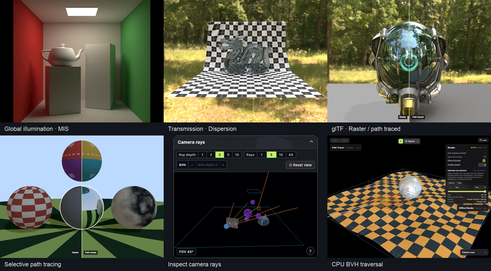
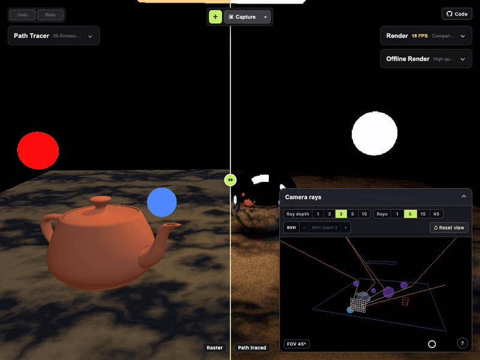
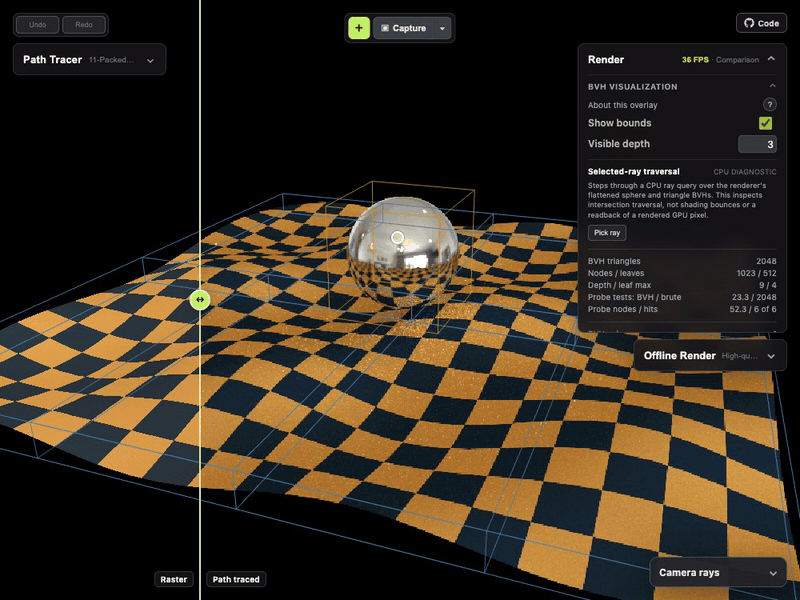

<p align="center">
  
</p>

# Path Tracer Lab

**[Try it here](https://pathtracer-lab.vercel.app/)**

An interactive path tracer for learning how rendering works. Edit scenes, compare raster and path-traced output, and inspect rays and acceleration structures.

Built with Three.js, React, and a custom WebGL2 path tracer.

[](docs/media/showcase.webp)

Captured in the app. [Images, settings, and credits](docs/media/README.md).

[](https://pathtracer-lab.vercel.app/)

Camera movement, ray visualization, and raster/path-traced comparison.

[](https://pathtracer-lab.vercel.app/)

Step through a picked ray's BVH traversal. This is a CPU diagnostic, not live GPU pixel readback.

## Features

- **Scene editing:** spheres, quads, analytic boxes, teapots, and static GLB import; editable transforms and materials with undo/redo.
- **Render modes:** raster, path traced, split comparison, region, and selected-object rendering.
- **Visualization:** camera rays and bounces, BVH bounds, and step-by-step ray traversal, with explanatory tooltips.
- **Captures:** PNGs with optional overlays and panels; offline stills with independent resolution and sample settings, pause, and cancel.

## Rendering

- Progressive accumulation; configurable samples, bounce depth, resolution, and precision.
- BSDF-only, direct-light, and multiple importance sampling (MIS).
- Perspective and orthographic cameras, with depth of field.
- Analytic primitives, indexed triangle meshes, and sphere/triangle BVHs.
- Image and procedural textures, emissive geometry, point/spot/directional lights, and importance-sampled HDR environments.
- RTIOW materials and principled metallic-roughness shading, including rough transmission, volume attenuation, and dispersion.

## Run locally

Requires **Node.js 22.22.2**, **pnpm 10.9.0**, and a WebGL2-capable browser and GPU.

```sh
git clone https://github.com/sbobyn/pathtracer-lab.git
cd pathtracer-lab
pnpm install
pnpm dev
```

Open the URL printed by Vite, normally `http://localhost:3005/pathtracer-lab/`. The editor UI dependency is bundled in `vendor/`.

The default scene is Emissive Study in Comparison mode with MIS. Drag the divider, select an object to edit it, or open **Camera Rays**. On mobile, use the bottom navigation to switch inspectors. **Copy preset link** in the Scene panel shares a preset, not your local edits.

Automatic calibration targets 30 FPS and prioritizes resolution. Higher FPS targets are available in performance settings.

```sh
pnpm verify  # Tests, RNG precision check, typecheck, production build
pnpm build   # Production files in dist/, served under /pathtracer-lab/
```

GitHub Actions runs `pnpm verify`. Vercel uses the checked-in configuration to build for the domain root; for other root-hosted deployments, run `pnpm build --base=/`.

## Limitations

- **WebGL2 only.** WebGPU is planned. Performance and compatibility vary by device and browser.
- **Static glTF subset.** No animation, skinning, morph targets, secondary UVs, texture transforms, normal maps, or full alpha/render-state fidelity.
- **Four unique material images per scene.** Larger textured assets may exceed this limit.
- **No project saving.** Preferences persist; scene edits and render history do not. Download renders you want to keep.
- **Shared GPU.** Offline rendering can reduce interactive FPS; switch the interactive view to Raster for less overhead.
- **Approximate raster comparison.** Both modes share scene data, but use different lighting models.

## Background

Built on [three-pathtracer](https://github.com/sbobyn/three-pathtracer), which began with Peter Shirley's [Ray Tracing in One Weekend](https://raytracing.github.io/).

Three.js provides the editable scene; `SceneCompiler` converts it into renderer-owned data for the WebGL backend. React provides the UI.

## Credits and licensing

The project's source code is licensed under the [MIT License](LICENSE).

Assets and dependencies have separate licenses: see [asset credits](src/assets/README.md) and [Khronos notices](src/assets/gltf/khronos-pbr/README.md). The Stanford dragon's included license contains non-commercial restrictions; the source-code MIT license does not cover all bundled assets.
